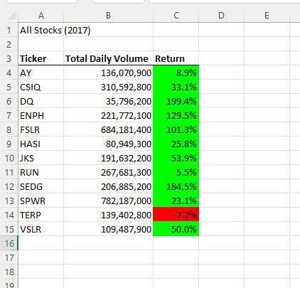
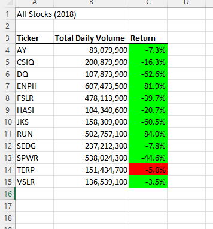

# VBA Stocks Analysis
## Project Overview
The purpose of this analysis was to refactor the code, that we previously wrote, to make it faster and more efficient. This code was used to scan through a list of stock data and display different metrics that indicated the performance of the various stocks in the years of 2017 and 2018. The metrics used were the total daily volume and the returns of twelve different stock tickers. 
## Results
After running the macro on both years, it was obvious that these stocks performed much better in 2017. In 2017, only one stock had a negative return, compared to 2018 where ten stocks had a negative return.
  

Another result was a faster run time for the refactored code. (Insert run time pictures) The refactoring helped trim out some of the unnecessary code, which led to a faster and more efficient code. We were able to take the original code that includes multiple subs and condense them into just a single sub. The code was refined in some of our if/then statements as well. The “and” portion of the if/then statements was unnecessary, so it was dropped. (Insert if/then pics) 
## Summary
Refactoring is a useful tool in a coder’s toolbox. It allows for the reuse of portions of previously written code thus saving time and eliminating the hassle of creating new code from scratch. It also offers the opportunity to take existing code and streamline it for better efficiency. This leads to faster code and increases the readability of the code. While there is a lot of good to be gained from refactoring code, there are some downfalls as well. When reusing old code, it is necessary to recognize that any flaws in that preexisting code come along with it. These flaws, if not caught and fixed, can derail the analysis. 
In this project, the refactoring saved us from having to start from scratch. Our original VBA script needed just a little trimming and alteration, for it to serve our new purpose. This also led to the, previously mentioned, faster run times of our code. Thankfully, in our case, the original VBA code was in good working order, and this saved us from importing any pre-existing flaws. The pros of refactoring were present due to great care in the original code, and we were able to avoid the cons for the same reason. 
